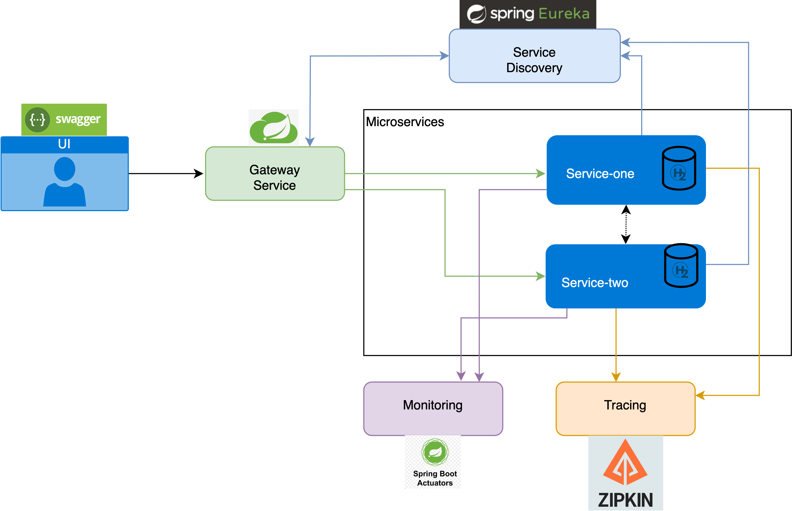

# Euraka-server

Microservice Paraktikum Tutorial -Winter 2024/25 - Sample service called: Service Discovery

This is a sample microservice demonstrating how to create a simple service discovery  using the Spring Boot framework .

## Project Technology Stack:

- **Java 17 (+)**
- [**Spring boot**](https://spring.io/projects/spring-boot) : framework
- [**Maven**](https://maven.apache.org/): build automation tool 
- [**Eureka**](https://cloud.spring.io/spring-cloud-netflix/reference/html/): service discovery

## Running

For starting the program, open the project inside your IDE, go to the **src/main/java/EurekaServerApplication.java** and run the class.

### usefull links after running the programm:
- http://localhost:8761/ (Eureka server)

  

